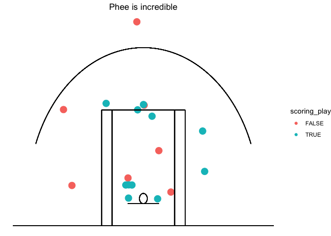
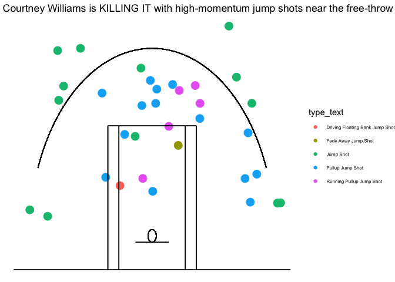
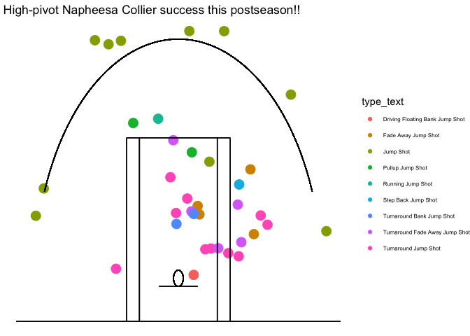
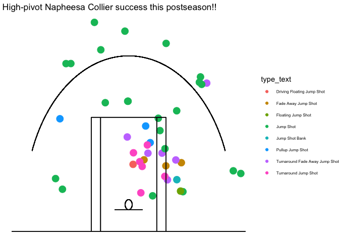

Liberty Lynx Game One
================
2024-10-12

## What a start!

This is a little R investigation to the question:

> How did the Lynx come back to win so decisively?

Let’s get started with some WNBA R packages.

``` r
library(wehoop)
library(dplyr)
```

    ## 
    ## Attaching package: 'dplyr'

    ## The following objects are masked from 'package:stats':
    ## 
    ##     filter, lag

    ## The following objects are masked from 'package:base':
    ## 
    ##     intersect, setdiff, setequal, union

``` r
library(tidyr)
library(ggplot2)
library(ggforce)
library(gtExtras)
```

    ## Loading required package: gt

``` r
wnba_pbp <- wehoop::load_wnba_pbp()
```

``` r
finals_game_one_id <- 401726988

finals_game_one_pbp <- wnba_pbp %>%
  filter(game_id == finals_game_one_id)
```

``` r
#finals_game_one_pbp %>%
#  View()
# 
player_court_id <- 2987891
player_phee_id <- 3917450
# 
# finals_game_one_pbp %>%
#   filter(athlete_id_1 == player_court_id) %>%
#   filter(shooting_play == TRUE) %>%
#   View()
# 
# finals_game_one_pbp %>%
#   filter(athlete_id_1 == player_phee_id) %>%
#   filter(shooting_play == TRUE) %>%
#   View()
# 
```

``` r
finals_game_one_pbp %>%
  mutate(coordinate_x_raw = 50-coordinate_x_raw) %>%
  filter(athlete_id_1 == player_court_id) %>%
  filter(shooting_play == TRUE) %>%
  ggplot(aes(x = coordinate_x_raw, y = coordinate_y_raw, color = scoring_play, size = 8)) +
  geom_jitter() +
    geom_segment(aes(x = 0, y = -4, xend = 50, yend = -4, alpha =0.1), inherit.aes = FALSE) +
    geom_segment(aes(x = 17, y = 13, xend = 33, yend = 13, alpha =0.1), inherit.aes = FALSE) +
    geom_segment(aes(x = 17, y = -4, xend = 17, yend = 13, alpha =0.1), inherit.aes = FALSE) +
    geom_segment(aes(x = 19, y = -4, xend = 19, yend = 13, alpha =0.1), inherit.aes = FALSE) +
    geom_segment(aes(x = 31, y = -4, xend = 31, yend = 13, alpha =0.1), inherit.aes = FALSE) +
    geom_segment(aes(x = 33, y = -4, xend = 33, yend = 13, alpha =0.1), inherit.aes = FALSE) +
    geom_segment(aes(x = 22, y = -0.75, xend = 28, yend = -0.75, alpha =0.1), inherit.aes = FALSE) +
    geom_circle(aes(x0 = 25, y0 = 0, r = 0.75), inherit.aes = FALSE) +
    geom_arc(aes(x0 = 25, y0= 0, r = 22.145, start = -1.2, end = 1.2), inherit.aes = FALSE) +
    #geom_segment(aes(x = 3, y = -4, xend = 3, yend = 10, alpha =0.1), inherit.aes = FALSE) +
    #geom_segment(aes(x = 47, y = -4, xend = 47, yend = 10, alpha =0.1), inherit.aes = FALSE) +
    scale_size(guide = "none") +
    scale_alpha(guide = "none") +
    xlab("")+
    ylab("")+
    ggtitle("This chart was an excuse to watch Courtney Williams replays") +
    theme_void() +
    theme(plot.title = element_text(hjust = 0.5))
```

<!-- -->

``` r
finals_game_one_pbp %>%
  mutate(coordinate_x_raw = 50-coordinate_x_raw) %>%
  filter(athlete_id_1 == player_phee_id) %>%
  filter(shooting_play == TRUE) %>%
  ggplot(aes(x = coordinate_x_raw, y = coordinate_y_raw, color = scoring_play, size = 8)) +
  geom_jitter() +
    geom_segment(aes(x = 0, y = -4, xend = 50, yend = -4, alpha =0.1), inherit.aes = FALSE) +
    geom_segment(aes(x = 17, y = 13, xend = 33, yend = 13, alpha =0.1), inherit.aes = FALSE) +
    geom_segment(aes(x = 17, y = -4, xend = 17, yend = 13, alpha =0.1), inherit.aes = FALSE) +
    geom_segment(aes(x = 19, y = -4, xend = 19, yend = 13, alpha =0.1), inherit.aes = FALSE) +
    geom_segment(aes(x = 31, y = -4, xend = 31, yend = 13, alpha =0.1), inherit.aes = FALSE) +
    geom_segment(aes(x = 33, y = -4, xend = 33, yend = 13, alpha =0.1), inherit.aes = FALSE) +
    geom_segment(aes(x = 22, y = -0.75, xend = 28, yend = -0.75, alpha =0.1), inherit.aes = FALSE) +
    geom_circle(aes(x0 = 25, y0 = 0, r = 0.75), inherit.aes = FALSE) +
    geom_arc(aes(x0 = 25, y0= 0, r = 22.145, start = -1.2, end = 1.2), inherit.aes = FALSE) +
    #geom_segment(aes(x = 3, y = -4, xend = 3, yend = 10, alpha =0.1), inherit.aes = FALSE) +
    #geom_segment(aes(x = 47, y = -4, xend = 47, yend = 10, alpha =0.1), inherit.aes = FALSE) +
    scale_size(guide = "none") +
    scale_alpha(guide = "none") +
    xlab("")+
    ylab("")+
    ggtitle("Phee is incredible") +
    theme_void() +
    theme(plot.title = element_text(hjust = 0.5))
```

<!-- -->

``` r
# find all 4 point_plays

wnba_pbp %>%
  mutate(day = as.Date(wallclock)) %>%
  group_by(home_team_mascot, away_team_mascot, season, game_id, day, athlete_id_1,period_display_value, clock_display_value) %>%
  summarize(total_points = sum(score_value)) %>%
  filter(total_points > 3) %>%
  arrange(desc(total_points))
```

    ## `summarise()` has grouped output by 'home_team_mascot', 'away_team_mascot',
    ## 'season', 'game_id', 'day', 'athlete_id_1', 'period_display_value'. You can
    ## override using the `.groups` argument.

    ## # A tibble: 20 × 9
    ## # Groups:   home_team_mascot, away_team_mascot, season, game_id, day,
    ## #   athlete_id_1, period_display_value [20]
    ##    home_team_mascot away_team_mascot season   game_id day        athlete_id_1
    ##    <chr>            <chr>             <int>     <int> <date>            <int>
    ##  1 Wings            Fever              2024 401620409 2024-09-01      3142191
    ##  2 Aces             Lynx               2024 401620285 2024-06-12      2529205
    ##  3 Dream            Aces               2024 401620257 2024-06-01      4065870
    ##  4 Fever            Mercury            2024 401620370 2024-08-16      4433403
    ##  5 Fever            Sun                2024 401620232 2024-05-20      3142191
    ##  6 Fever            Sun                2024 401620397 2024-08-29          869
    ##  7 Liberty          Lynx               2024 401726988 2024-10-11      2987891
    ##  8 Liberty          Sky                2024 401620239 2024-05-24      2998928
    ##  9 Liberty          Sun                2024 401620362 2024-07-16      4066533
    ## 10 Lynx             Sparks             2024 401620455 2024-09-20      2987891
    ## 11 Lynx             Storm              2024 401620226 2024-05-18      2529205
    ## 12 Lynx             Sun                2024 401725079 2024-10-09      2987891
    ## 13 Mercury          Sun                2024 401620440 2024-09-14      4068885
    ## 14 Mystics          Liberty            2024 401620448 2024-09-18      3056730
    ## 15 Sky              Fever              2024 401620313 2024-06-23      3142191
    ## 16 Sparks           Lynx               2024 401620270 2024-06-06      4398764
    ## 17 Storm            Mercury            2024 401620423 2024-09-08      2491205
    ## 18 Sun              Lynx               2024 401725077 2024-10-05      2529205
    ## 19 Wings            Aces               2024 401620396 2024-08-28      4281929
    ## 20 Wings            Sparks             2024 401620392 2024-08-25      4433630
    ## # ℹ 3 more variables: period_display_value <chr>, clock_display_value <chr>,
    ## #   total_points <int>

There was actually one FIVE-point play - kelsey mitchell was fouled by
arike shooting a 3 on Sept 1st. Arike got a technical for complaining -
so it was a 5-point play!

### Four point games in 2024… wait, what?

``` r
wnba_pbp %>%
  mutate(day = as.Date(wallclock)) %>%
  group_by(home_team_mascot, away_team_mascot, season, game_id, day, athlete_id_1,period_display_value, clock_display_value) %>%
  summarize(total_points = sum(score_value)) %>%
  filter(total_points > 3) %>%
  arrange(desc(total_points)) %>%
  select(total_points) %>%
  group_by(total_points) %>%
  summarise(plays_in_2024 = n()) %>%
  rename(total_points_on_play = total_points) %>%
  select(plays_in_2024, total_points_on_play) %>%
  knitr::kable()
```

    ## `summarise()` has grouped output by 'home_team_mascot', 'away_team_mascot',
    ## 'season', 'game_id', 'day', 'athlete_id_1', 'period_display_value'. You can
    ## override using the `.groups` argument.
    ## Adding missing grouping variables: `home_team_mascot`, `away_team_mascot`,
    ## `season`, `game_id`, `day`, `athlete_id_1`, `period_display_value`

| plays_in_2024 | total_points_on_play |
|--------------:|---------------------:|
|            19 |                    4 |
|             1 |                    5 |

``` r
#%>%
 # gt() %>% 
  #gt_theme_guardian() %>% 
  #tab_header(title = "Four point games in 2024... wait, what?")
```

``` r
finals_game_one_pbp %>%
  mutate(coordinate_x_raw = 50-coordinate_x_raw) %>%
  filter(athlete_id_1 == player_court_id) %>%
  filter(shooting_play == TRUE) %>%
  filter(sequence_number == 482) %>%
  ggplot(aes(x = coordinate_x_raw, y = coordinate_y_raw,  size = 8)) +
  geom_point() +
    geom_segment(aes(x = 0, y = -4, xend = 50, yend = -4, alpha =0.1), inherit.aes = FALSE) +
    geom_segment(aes(x = 17, y = 13, xend = 33, yend = 13, alpha =0.1), inherit.aes = FALSE) +
    geom_segment(aes(x = 17, y = -4, xend = 17, yend = 13, alpha =0.1), inherit.aes = FALSE) +
    geom_segment(aes(x = 19, y = -4, xend = 19, yend = 13, alpha =0.1), inherit.aes = FALSE) +
    geom_segment(aes(x = 31, y = -4, xend = 31, yend = 13, alpha =0.1), inherit.aes = FALSE) +
    geom_segment(aes(x = 33, y = -4, xend = 33, yend = 13, alpha =0.1), inherit.aes = FALSE) +
    geom_segment(aes(x = 22, y = -0.75, xend = 28, yend = -0.75, alpha =0.1), inherit.aes = FALSE) +
    geom_circle(aes(x0 = 25, y0 = 0, r = 0.75), inherit.aes = FALSE) +
    geom_arc(aes(x0 = 25, y0= 0, r = 22.145, start = -1.2, end = 1.2), inherit.aes = FALSE) +
    #geom_segment(aes(x = 3, y = -4, xend = 3, yend = 10, alpha =0.1), inherit.aes = FALSE) +
    #geom_segment(aes(x = 47, y = -4, xend = 47, yend = 10, alpha =0.1), inherit.aes = FALSE) +
    scale_size(guide = "none") +
    scale_alpha(guide = "none") +
    xlab("")+
    ylab("")+
    ggtitle("Wasn't this shot from the edge of the key?") +
    theme_void() +
    theme(plot.title = element_text(hjust = 0.5))
```

<!-- -->

Now here’s Phee in the post-season

``` r
wnba_pbp %>%
  mutate(coordinate_x_raw = 50-coordinate_x_raw) %>%
  mutate(day = as.Date(wallclock)) %>%
  filter(day >= "2024-09-22") %>%
  filter(athlete_id_1 == player_court_id) %>%
  filter(shooting_play == TRUE) %>%
  filter(!grepl("Free Throw", type_text)) %>%
  filter(grepl("Jump Shot", type_text)) %>%
  filter(scoring_play == TRUE) %>%
  ggplot(aes(x = coordinate_x_raw, y = coordinate_y_raw, color = type_text, size = 8, alpha = 0.4)) +
  geom_jitter() +
    geom_segment(aes(x = 0, y = -4, xend = 50, yend = -4, alpha =0.1), inherit.aes = FALSE) +
    geom_segment(aes(x = 17, y = 13, xend = 33, yend = 13, alpha =0.1), inherit.aes = FALSE) +
    geom_segment(aes(x = 17, y = -4, xend = 17, yend = 13, alpha =0.1), inherit.aes = FALSE) +
    geom_segment(aes(x = 19, y = -4, xend = 19, yend = 13, alpha =0.1), inherit.aes = FALSE) +
    geom_segment(aes(x = 31, y = -4, xend = 31, yend = 13, alpha =0.1), inherit.aes = FALSE) +
    geom_segment(aes(x = 33, y = -4, xend = 33, yend = 13, alpha =0.1), inherit.aes = FALSE) +
    geom_segment(aes(x = 22, y = -0.75, xend = 28, yend = -0.75, alpha =0.1), inherit.aes = FALSE) +
    geom_circle(aes(x0 = 25, y0 = 0, r = 0.75), inherit.aes = FALSE) +
    geom_arc(aes(x0 = 25, y0= 0, r = 22.145, start = -1.2, end = 1.2), inherit.aes = FALSE) +
    #geom_segment(aes(x = 3, y = -4, xend = 3, yend = 10, alpha =0.1), inherit.aes = FALSE) +
    #geom_segment(aes(x = 47, y = -4, xend = 47, yend = 10, alpha =0.1), inherit.aes = FALSE) +
    scale_size(guide = "none") +
    scale_alpha(guide = "none") +
    xlab("")+
    ylab("")+
    ggtitle(" Courtney Williams is KILLING IT with high-momentum jump shots near the free-throw line") +
    theme_void() +
   # theme(plot.title = element_text(hjust = 0.5)) +
    theme(legend.text=element_text(size=6))
```

<!-- -->

``` r
wnba_pbp %>%
  mutate(coordinate_x_raw = 50-coordinate_x_raw) %>%
  mutate(day = as.Date(wallclock)) %>%
  filter(day >= "2024-09-22") %>%
  filter(athlete_id_1 == player_court_id) %>%
  filter(shooting_play == TRUE) %>%
  filter(!grepl("Free Throw", type_text)) %>%
  filter(grepl("Jump Shot", type_text)) %>%
  filter(scoring_play == FALSE) %>%
  ggplot(aes(x = coordinate_x_raw, y = coordinate_y_raw, color = type_text, size = 8, alpha = 0.4)) +
  geom_jitter() +
    geom_segment(aes(x = 0, y = -4, xend = 50, yend = -4, alpha =0.1), inherit.aes = FALSE) +
    geom_segment(aes(x = 17, y = 13, xend = 33, yend = 13, alpha =0.1), inherit.aes = FALSE) +
    geom_segment(aes(x = 17, y = -4, xend = 17, yend = 13, alpha =0.1), inherit.aes = FALSE) +
    geom_segment(aes(x = 19, y = -4, xend = 19, yend = 13, alpha =0.1), inherit.aes = FALSE) +
    geom_segment(aes(x = 31, y = -4, xend = 31, yend = 13, alpha =0.1), inherit.aes = FALSE) +
    geom_segment(aes(x = 33, y = -4, xend = 33, yend = 13, alpha =0.1), inherit.aes = FALSE) +
    geom_segment(aes(x = 22, y = -0.75, xend = 28, yend = -0.75, alpha =0.1), inherit.aes = FALSE) +
    geom_circle(aes(x0 = 25, y0 = 0, r = 0.75), inherit.aes = FALSE) +
    geom_arc(aes(x0 = 25, y0= 0, r = 22.145, start = -1.2, end = 1.2), inherit.aes = FALSE) +
    #geom_segment(aes(x = 3, y = -4, xend = 3, yend = 10, alpha =0.1), inherit.aes = FALSE) +
    #geom_segment(aes(x = 47, y = -4, xend = 47, yend = 10, alpha =0.1), inherit.aes = FALSE) +
    scale_size(guide = "none") +
    scale_alpha(guide = "none") +
    xlab("")+
    ylab("")+
    ggtitle(" Her traditional KILL ZONE is less successful this post-season. Here are her misses.") +
    theme_void() +
   # theme(plot.title = element_text(hjust = 0.5)) +
    theme(legend.text=element_text(size=6))
```

<!-- -->

### “Since the start of this postseason, Courtney has struggled with pullup jump shots - except when she’s mid-sprint!!”

``` r
wnba_pbp %>%
  mutate(coordinate_x_raw = 50-coordinate_x_raw) %>%
  mutate(day = as.Date(wallclock)) %>%
  filter(day >= "2024-09-22") %>%
  filter(athlete_id_1 == player_court_id) %>%
  filter(shooting_play == TRUE) %>%
  filter(!grepl("Free Throw", type_text)) %>%
  group_by(type_text, scoring_play ) %>%
  summarize(count = n()) %>%
  pivot_wider(names_from = scoring_play , values_from = count, values_fill = 0) %>%
  mutate(attempts = `FALSE` + `TRUE`) %>%
  mutate(success_rate = `TRUE` / attempts) %>%
  rename(makes = `TRUE`) %>%
  arrange(desc(success_rate)) %>%
  select(-`FALSE`) %>%
  filter(grepl("Jump Shot", type_text)) %>%
  mutate(makes_and_attempts = paste0(makes, " for ", attempts)) %>%
  rename(jumpshot_type = type_text) %>%
  select(jumpshot_type, makes_and_attempts, success_rate)  %>%
  knitr::kable()
```

    ## `summarise()` has grouped output by 'type_text'. You can override using the
    ## `.groups` argument.

| jumpshot_type                   | makes_and_attempts | success_rate |
|:--------------------------------|:-------------------|-------------:|
| Driving Floating Bank Jump Shot | 1 for 1            |    1.0000000 |
| Fade Away Jump Shot             | 1 for 1            |    1.0000000 |
| Running Pullup Jump Shot        | 5 for 8            |    0.6250000 |
| Jump Shot                       | 13 for 21          |    0.6190476 |
| Pullup Jump Shot                | 14 for 46          |    0.3043478 |
| Driving Floating Jump Shot      | 0 for 1            |    0.0000000 |
| Running Jump Shot               | 0 for 2            |    0.0000000 |

``` r
#%>%
  #gt() %>% 
  #gt_theme_guardian() %>% 
  #tab_header(title = "Since the start of this postseason, Courtney has struggled with pullup jump shots - except when she's mid-sprint!!")
```

Let’s compare with Phee.

### Napheesa Collier shows a similar inclination towards more complex jump shots. But hers are pivot-y!

``` r
wnba_pbp %>%
  mutate(coordinate_x_raw = 50-coordinate_x_raw) %>%
  mutate(day = as.Date(wallclock)) %>%
  filter(day >= "2024-09-22") %>%
  filter(athlete_id_1 == player_phee_id) %>%
  filter(shooting_play == TRUE) %>%
  filter(!grepl("Free Throw", type_text)) %>%
  group_by(type_text, scoring_play ) %>%
  summarize(count = n()) %>%
  pivot_wider(names_from = scoring_play , values_from = count, values_fill = 0) %>%
  mutate(attempts = `FALSE` + `TRUE`) %>%
  mutate(success_rate = `TRUE` / attempts) %>%
  rename(makes = `TRUE`) %>%
  arrange(desc(attempts)) %>%
  select(-`FALSE`) %>%
  filter(grepl("Jump Shot", type_text)) %>%
  mutate(makes_and_attempts = paste0(makes, " for ", attempts)) %>%
  rename(jumpshot_type = type_text) %>%
  select(jumpshot_type, makes_and_attempts, success_rate) %>%
  knitr::kable()
```

    ## `summarise()` has grouped output by 'type_text'. You can override using the
    ## `.groups` argument.

| jumpshot_type                   | makes_and_attempts | success_rate |
|:--------------------------------|:-------------------|-------------:|
| Jump Shot                       | 10 for 32          |    0.3125000 |
| Turnaround Jump Shot            | 10 for 16          |    0.6250000 |
| Turnaround Fade Away Jump Shot  | 5 for 11           |    0.4545455 |
| Fade Away Jump Shot             | 4 for 7            |    0.5714286 |
| Pullup Jump Shot                | 2 for 5            |    0.4000000 |
| Turnaround Bank Jump Shot       | 2 for 2            |    1.0000000 |
| Driving Floating Bank Jump Shot | 1 for 1            |    1.0000000 |
| Driving Floating Jump Shot      | 0 for 1            |    0.0000000 |
| Floating Jump Shot              | 0 for 1            |    0.0000000 |
| Jump Shot Bank                  | 0 for 1            |    0.0000000 |
| Running Jump Shot               | 1 for 1            |    1.0000000 |
| Step Back Jump Shot             | 1 for 1            |    1.0000000 |

``` r
#%>%
 # gt() %>% 
  #gt_theme_guardian() %>% 
#  tab_header(title = "Napheesa Collier shows a similar inclination towards more complex jump shots. But hers are pivot-y!")
```

``` r
wnba_pbp %>%
  mutate(coordinate_x_raw = 50-coordinate_x_raw) %>%
  mutate(day = as.Date(wallclock)) %>%
  filter(day >= "2024-09-22") %>%
  filter(athlete_id_1 == player_phee_id) %>%
  filter(shooting_play == TRUE) %>%
  filter(!grepl("Free Throw", type_text)) %>%
  filter(grepl("Jump Shot", type_text)) %>%
  filter(scoring_play == TRUE) %>%
  ggplot(aes(x = coordinate_x_raw, y = coordinate_y_raw, color = type_text, size = 8, alpha = 0.4)) +
  geom_jitter() +
    geom_segment(aes(x = 0, y = -4, xend = 50, yend = -4, alpha =0.1), inherit.aes = FALSE) +
    geom_segment(aes(x = 17, y = 13, xend = 33, yend = 13, alpha =0.1), inherit.aes = FALSE) +
    geom_segment(aes(x = 17, y = -4, xend = 17, yend = 13, alpha =0.1), inherit.aes = FALSE) +
    geom_segment(aes(x = 19, y = -4, xend = 19, yend = 13, alpha =0.1), inherit.aes = FALSE) +
    geom_segment(aes(x = 31, y = -4, xend = 31, yend = 13, alpha =0.1), inherit.aes = FALSE) +
    geom_segment(aes(x = 33, y = -4, xend = 33, yend = 13, alpha =0.1), inherit.aes = FALSE) +
    geom_segment(aes(x = 22, y = -0.75, xend = 28, yend = -0.75, alpha =0.1), inherit.aes = FALSE) +
    geom_circle(aes(x0 = 25, y0 = 0, r = 0.75), inherit.aes = FALSE) +
    geom_arc(aes(x0 = 25, y0= 0, r = 22.145, start = -1.2, end = 1.2), inherit.aes = FALSE) +
    #geom_segment(aes(x = 3, y = -4, xend = 3, yend = 10, alpha =0.1), inherit.aes = FALSE) +
    #geom_segment(aes(x = 47, y = -4, xend = 47, yend = 10, alpha =0.1), inherit.aes = FALSE) +
    scale_size(guide = "none") +
    scale_alpha(guide = "none") +
    xlab("")+
    ylab("")+
    ggtitle(" High-pivot Napheesa Collier success this postseason!!") +
    theme_void() +
   # theme(plot.title = element_text(hjust = 0.5)) +
    theme(legend.text=element_text(size=6))
```

<!-- -->

``` r
wnba_pbp %>%
  mutate(coordinate_x_raw = 50-coordinate_x_raw) %>%
  mutate(day = as.Date(wallclock)) %>%
  filter(day >= "2024-09-22") %>%
  filter(athlete_id_1 == player_phee_id) %>%
  filter(shooting_play == TRUE) %>%
  filter(!grepl("Free Throw", type_text)) %>%
  filter(grepl("Jump Shot", type_text)) %>%
  filter(scoring_play == FALSE) %>%
  ggplot(aes(x = coordinate_x_raw, y = coordinate_y_raw, color = type_text, size = 8, alpha = 0.4)) +
  geom_jitter() +
    geom_segment(aes(x = 0, y = -4, xend = 50, yend = -4, alpha =0.1), inherit.aes = FALSE) +
    geom_segment(aes(x = 17, y = 13, xend = 33, yend = 13, alpha =0.1), inherit.aes = FALSE) +
    geom_segment(aes(x = 17, y = -4, xend = 17, yend = 13, alpha =0.1), inherit.aes = FALSE) +
    geom_segment(aes(x = 19, y = -4, xend = 19, yend = 13, alpha =0.1), inherit.aes = FALSE) +
    geom_segment(aes(x = 31, y = -4, xend = 31, yend = 13, alpha =0.1), inherit.aes = FALSE) +
    geom_segment(aes(x = 33, y = -4, xend = 33, yend = 13, alpha =0.1), inherit.aes = FALSE) +
    geom_segment(aes(x = 22, y = -0.75, xend = 28, yend = -0.75, alpha =0.1), inherit.aes = FALSE) +
    geom_circle(aes(x0 = 25, y0 = 0, r = 0.75), inherit.aes = FALSE) +
    geom_arc(aes(x0 = 25, y0= 0, r = 22.145, start = -1.2, end = 1.2), inherit.aes = FALSE) +
    #geom_segment(aes(x = 3, y = -4, xend = 3, yend = 10, alpha =0.1), inherit.aes = FALSE) +
    #geom_segment(aes(x = 47, y = -4, xend = 47, yend = 10, alpha =0.1), inherit.aes = FALSE) +
    scale_size(guide = "none") +
    scale_alpha(guide = "none") +
    xlab("")+
    ylab("")+
    ggtitle(" High-pivot Napheesa Collier success this postseason!!") +
    theme_void() +
   # theme(plot.title = element_text(hjust = 0.5)) +
    theme(legend.text=element_text(size=6))
```

<!-- -->
